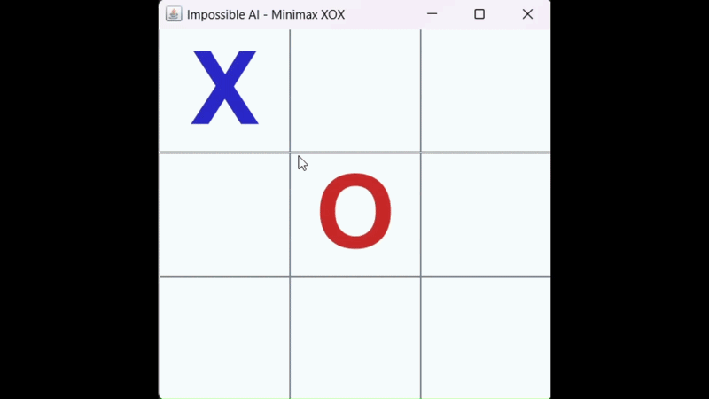

# 🧠 Unbeatable Tic-Tac-Toe AI (Minimax & Alpha-Beta Pruning)


A classic Tic-Tac-Toe game with a desktop GUI built in core Java (Swing/AWT), featuring an unbeatable Artificial Intelligence opponent. The AI is powered by the **Minimax Algorithm**, which calculates all possible future game states to make the optimal move. To ensure maximum efficiency, it utilizes **Alpha-Beta Pruning** to drastically reduce the number of nodes evaluated in the game tree.

## 🎥 Gameplay Showcase



## ✨ Key Features & Mechanics

- **Minimax Decision Tree:** The AI acts as the "Maximizer," simulating every possible move to the end of the game to ensure it never loses.
- **Alpha-Beta Pruning:** An advanced optimization technique that stops evaluating a move entirely if it finds that a worse option has already been proven. This cuts down computation time significantly.
- **Java Swing GUI:** A clean, fully functional graphical user interface with interactive buttons and end-game popups.
- **Zero External Dependencies:** 100% core Java implementation of game logic and UI.

## 💻 How to Run

1. Clone the repository and compile the Java file:
   ```bash
   git clone [https://github.com/](https://github.com/)<Senin-Kullanici-Adin>/Minimax-Tic-Tac-Toe.git
   javac TicTacToeGUI.java
   ```
